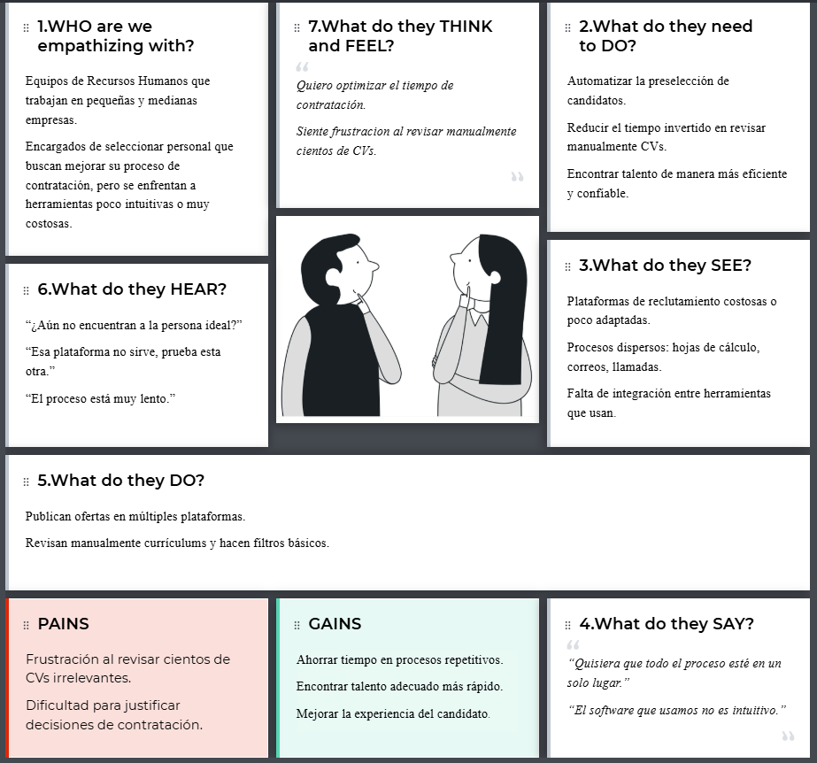
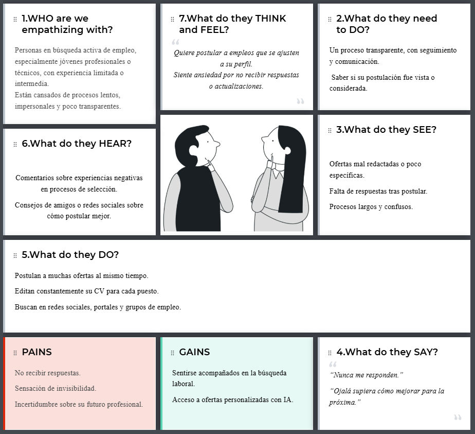
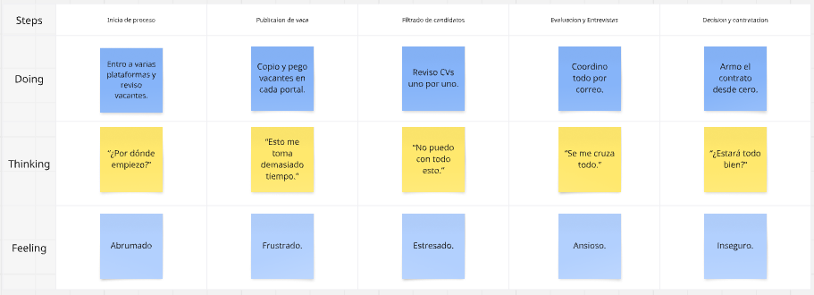
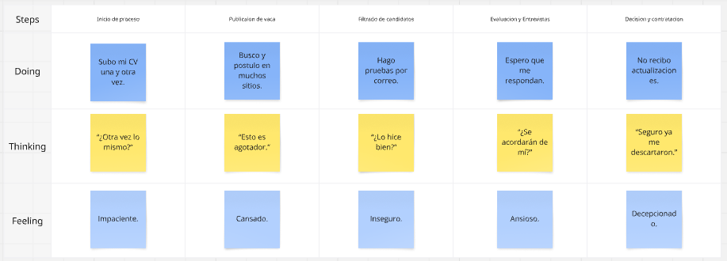
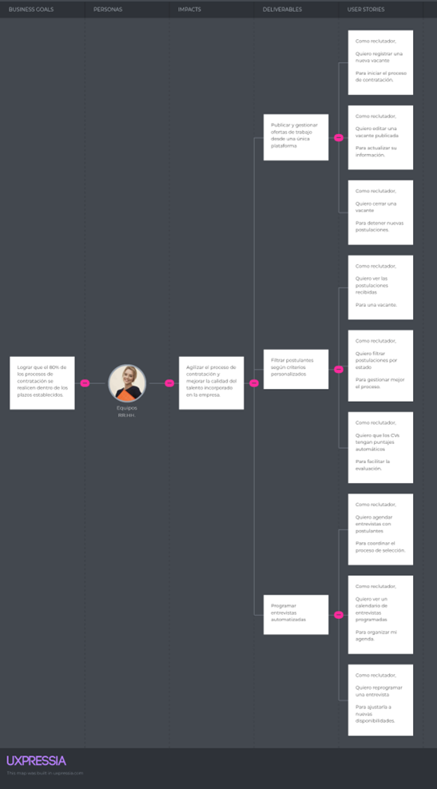
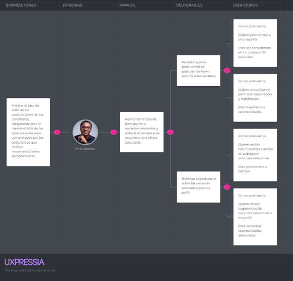

  

    <h2 style="text-align: center;">Universidad Peruana de Ciencias Aplicadas</h2>
    <h4 style="text-align: center;">Ingeniería de Software</h2> 
    <h4 style="text-align: center"> Periodo: 202520 </h4>
    <h4 style="text-align: center"> 1ASI0732 - Diseño de Experimentos de Ingeniería de Software </h4>
    <h4 style="text-align: center"> NRC: 12278  </h4>
    <h4 style="text-align: center"> Docente: Julio Manuel Noriega Melendez </h4>

 

    <h3 style="text-align: center">Informe del Trabajo Final </h3>
    <h4 style="text-align: center;"> Startup: WorkMate </h3>
    <h4 style="text-align: center"> Producto: Jobsy </h4>

 

    
U202311258 — Hernádez Uchuya, María Patricia

    
U202310008 — Urrutia Pena, Jasmin Adriana

    
U202317000 — Vega Coronado, Fabricio Samir

    
U20231c168 — Villanueva Andrade, Ysaac Ligorio

    <h4 style="text-align: center">Lima – abril 2025</h4>

## Registro de Versiones del Informe

| Versión | Fecha | Autor | Descripción |
| :--- | :--- | :--- | :--- |
| AV1 | 23/04/2026 | Equipo de Desarrollo | Estructura inicial completa |

## Project Report Collaboration Insights

---

## Tabla de Contenidos

1. [Student Outcome](#student-outcome)
2. [Part I: As-Is Software Project](#part-i)
    * [Capítulo I: Introducción](#cap-1)
        * [1.1. Startup Profile](#1-1)
            * [1.1.1. Descripción de la Startup](#1-1-1)
            * [1.1.2. Perfiles de integrantes del equipo](#1-1-2)
        * [1.2. Solution Profile](#1-2)
            * [1.2.1. Antecedentes y problemática](#1-2-1)
            * [1.2.2. Lean UX Process](#1-2-2)
                * [1.2.2.1. Lean UX Problem Statements](#1-2-2-1)
                * [1.2.2.2. Lean UX Assumptions](#1-2-2-2)
                * [1.2.2.3. Lean UX Hypothesis Statements](#1-2-2-3)
                * [1.2.2.4. Lean UX Canvas](#1-2-2-4)
        * [1.3. Segmentos objetivo](#1-3)
    * [Capítulo II: Requirements Elicitation & Analysis](#cap-2)
        * [2.1. Competidores](#2-1)
            * [2.1.1. Análisis competitivo](#2-1-1)
            * [2.1.2. Estrategias y tácticas frente a competidores](#2-1-2)
        * [2.2. Entrevistas](#2-2)
            * [2.2.1. Diseño de entrevistas](#2-2-1)
            * [2.2.2. Registro de entrevistas](#2-2-2)
            * [2.2.3. Análisis de entrevistas](#2-2-3)
        * [2.3. Needfinding](#2-3)
            * [2.3.1. User Personas](#2-3-1)
            * [2.3.2. User Task Matrix](#2-3-2)
            * [2.3.3. User Journey Mapping](#2-3-3)
            * [2.3.4. Empathy Mapping](#2-3-4)
            * [2.3.5. As-is Scenario Mapping](#2-3-5)
        * [2.4. Ubiquitous Language](#2-4)
    * [Capítulo III: Requirements Specification](#cap-3)
        * [3.1. To-Be Scenario Mapping](#3-1)
        * [3.2. User Stories](#3-2)
        * [3.3. Product Backlog](#3-3)
        * [3.4. Impact Mapping](#3-4)
    * [Capítulo IV: Product Design](#cap-4)
        * [4.1. Style Guidelines](#4-1)
            * [4.1.1. General Style Guidelines](#4-1-1)
            * [4.1.2. Web Style Guidelines](#4-1-2)
        * [4.2. Information Architecture](#4-2)
            * [4.2.1. Organization Systems](#4-2-1)
            * [4.2.2. Labeling Systems](#4-2-2)
            * [4.2.3. SEO Tags and Meta Tags](#4-2-3)
            * [4.2.4. Searching Systems](#4-2-4)
            * [4.2.5. Navigation Systems](#4-2-5)
        * [4.3. Landing Page UI Design](#4-3)
            * [4.3.1. Landing Page Wireframe](#4-3-1)
            * [4.3.2. Landing Page Mock-up](#4-3-2)
        * [4.4. Web Applications UX/UI Design](#4-6)
            * [4.4.1. Web Applications Wireframes](#4-6-1)
            * [4.4.2. Web Applications Wireflow Diagrams](#4-6-2)
            * [4.4.3. Web Applications Mock-ups](#4-6-3)
            * [4.4.4. Web Applications User Flow Diagrams](#4-6-4)
        * [4.5. Web Applications Prototyping](#4-7)
        * [4.6. Domain-Driven Software Architecture](#4-8)
            * [4.6.1. Software Architecture Context Diagram](#4-8-1)
            * [4.6.2. Software Architecture Container Diagrams](#4-8-2)
            * [4.6.3. Software Architecture Components Diagrams](#4-8-3)
        * [4.7. Software Object-Oriented Design](#4-9)
            * [4.7.1. Class Diagrams](#4-9-1)
            * [4.7.2. Class Dictionary](#4-9-2)
        * [4.8. Database Design](#4-10)
            * [4.8.1. Relational/Non-Relational Database Diagram](#4-10-1)
    * [Capítulo V: Product Implementation](#cap-5)
        * [5.1. Software Configuration Management](#5-1)
            * [5.1.1. Software Development Environment Configuration](#5-1-1)
            * [5.1.2. Source Code Management](#5-1-2)
            * [5.1.3. Source Code Style Guide & Conventions](#5-1-3)
            * [5.1.4. Software Deployment Configuration](#5-1-4)
        * [5.2. Product Implementation & Deployment](#5-2)
            * [5.2.1. Sprint Backlogs](#5-2-1)
            * [5.2.2. Implemented Landing Page Evidence](#5-2-2)
            * [5.2.3. Implemented Frontend-Web Application Evidence](#5-2-3)
            * [5.2.4. Acuerdo de Servicio - SaaS](#5-2-4)
            * [5.2.5. Implemented RESTful API and/or Serverless Backend Evidence](#5-2-6)
            * [5.2.6. RESTful API documentation](#5-2-7)
            * [5.2.7. Team Collaboration Insights](#5-2-8)
        * [5.3. Video About-the-Product](#5-3)
3. [Part II: Verification, Validation & Pipeline](#part-2)
    * [Capítulo VI: Product Verification & Validation](#cap-6)
        * [6.1. Testing Suites & Validation](#6-1)
            * [6.1.1. Core Entities Unit Tests](#6-1-1)
            * [6.1.2. Core Integration Tests](#6-1-2)
            * [6.1.3. Core Behavior-Driven Development](#6-1-3)
            * [6.1.4. Core System Tests](#6-1-4)
        * [6.2. Static testing & Verification](#6-2)
            * [6.2.1. Static Code Analysis](#6-2-1)
                * [6.2.1.1. Coding standard & Code conventions](#6-2-1-1)
                * [6.2.1.2. Code Quality & Code Security](#6-2-1-2)
            * [6.2.2. Reviews](#6-2-2)
        * [6.3. Validation Interviews](#6-3)
            * [6.3.1. Diseño de Entrevistas](#6-3-1)
            * [6.3.2. Registro de Entrevistas](#6-3-2)
            * [6.3.3. Evaluaciones según heurísticas](#6-3-3)
        * [6.4. Auditoría de Experiencias de Usuario](#6-4)
            * [6.4.1. Auditoría realizada](#6-4-1)
                * [6.4.1.1. Información del grupo auditado](#6-4-1-1)
                * [6.4.1.2. Cronograma de auditoría realizada](#6-4-1-2)
                * [6.4.1.3. Contenido de auditoría realizada](#6-4-1-3)
            * [6.4.2. Auditoría recibida](#6-4-2)
                * [6.4.2.1. Información del grupo auditor](#6-4-2-1)
                * [6.4.2.2. Cronograma de auditoría recibida](#6-4-2-2)
                * [6.4.2.3. Contenido de auditoría recibida](#6-4-2-3)
                * [6.4.2.4. Resumen de modificaciones para subsanar hallazgos](#6-4-2-4)
    * [Capítulo VII: DevOps Practices](#cap-7)
        * [7.1. Continuous Integration](#7-1)
            * [7.1.1. Tools and Practices](#7-1-1)
            * [7.1.2. Build & Test Suite Pipeline Components](#7-1-2)
        * [7.2. Continuous Delivery](#7-2)
            * [7.2.1. Tools and Practices](#7-2-1)
            * [7.2.2. Stages Deployment Pipeline Components](#7-2-2)
        * [7.3. Continuous Deployment](#7-3)
            * [7.3.1. Tools and Practices](#7-3-1)
            * [7.3.2. Production Deployment Pipeline Components](#7-3-2)
        * [7.4. Continuous Monitoring](#7-4)
            * [7.4.1. Tools and Practices](#7-4-1)
            * [7.4.2. Monitoring Pipeline Components](#7-4-2)
            * [7.4.3. Alerting Pipeline Components](#7-4-3)
            * [7.4.4. Notification Pipeline Components](#7-4-4)
4. [Part III: Experiment-Driven Lifecycle](#part-3)
    * [Capítulo VIII: Experiment-Driven Development](#cap-8)
        * [8.1. Experiment Planning](#8-1)
            * [8.1.1. As-Is Summary](#8-1-1)
            * [8.1.2. Raw Material: Assumptions, Gaps, Ideas](#8-1-2)
            * [8.1.3. Experiment-Ready Questions](#8-1-3)
            * [8.1.4. Question Backlog](#8-1-4)
            * [8.1.5. Experiment Cards](#8-1-5)
        * [8.2. Experiment Design](#8-2)
            * [8.2.1. Hypotheses](#8-2-1)
            * [8.2.2. Domain Business Metrics](#8-2-2)
            * [8.2.3. Measures](#8-2-3)
            * [8.2.4. Conditions](#8-2-4)
            * [8.2.5. Scale Calculations and Decisions](#8-2-5)
            * [8.2.6. Methods Selection](#8-2-6)
            * [8.2.7. Data Analytics: Goals, KPIs](#8-2-7)
            * [8.2.8. Web and Mobile Tracking Plan](#8-2-8)
        * [8.3. Experimentation](#8-3)
            * [8.3.1. To-Be User Stories](#8-3-1)
            * [8.3.2. To-Be Product Backlog](#8-3-2)
            * [8.3.3. Pipeline-supported Software Lifecycle](#8-3-3)
                * [8.3.3.1. To-Be Sprint Backlogs](#8-3-3-1)
                * [8.3.3.2. Implemented To-Be Landing Page Evidence](#8-3-3-2)
                * [8.3.3.3. Implemented To-Be Web App Evidence](#8-3-3-3)
                * [8.3.3.4. Implemented To-Be Mobile App Evidence](#8-3-3-4)
                * [8.3.3.5. Implemented To-Be RESTful API Evidence](#8-3-3-5)
                * [8.3.3.6. Team Collaboration Insights](#8-3-3-6)
            * [8.3.4. To-Be Validation Interviews](#8-3-4)
                * [8.3.4.1. Diseño de Entrevistas](#8-3-4-1)
                * [8.3.4.2. Registro de Entrevistas](#8-3-4-2)
        * [8.4. Experiment Aftermath & Analysis](#8-4)
            * [8.4.1. Analysis and Interpretation of Results](#8-4-1)
            * [8.4.2. Re-scored Question Backlog](#8-4-2)
        * [8.5. Continuous Learning](#8-5)
            * [8.5.1. Shareback Session Artifacts](#8-5-1)
        * [8.6. To-Be Software Platform Pre-launch](#8-6)
            * [8.6.1. About-the-Product Intro Video](#8-6-1)
5. [Conclusiones](#conclusiones)
6. [Video App Validation](#v-validation)
7. [Video About-the-Team](#v-team)
8. [Bibliografía](#bibliografia)
9. [Anexos](#anexos)

---

## Student Outcome

## Part I: As-Is Software Project

### Capítulo I: Introducción

#### 1.1. Startup Profile

A continuación, se presenta una descripción de nuestra empresa Jobsy, así como la presentación del equipo de desarrollo responsable del software previamente mencionado, denominado "WorkMate".

##### 1.1.1. Descripción de la Startup

En la actualidad, muchas áreas de Recursos Humanos enfrentan dificultades para mantener una atención de calidad hacia los postulantes a empleos. Se ha identificado un alto nivel de estrés laboral en estos equipos, causado principalmente por la sobrecarga de tareas repetitivas como la revisión manual de currículums, la publicación de vacantes en múltiples plataformas y la coordinación de entrevistas. Esta carga operativa no solo ralentiza los procesos de selección, sino que también afecta negativamente la experiencia del candidato y la eficiencia del equipo de RRHH.

Jobsy nace como una solución tecnológica innovadora que busca transformar este panorama. A través de nuestra plataforma "WorkMate", automatizamos las tareas más operativas del proceso de selección: desde la publicación inteligente de vacantes y el filtrado de CVs mediante inteligencia artificial, hasta la organización de entrevistas y evaluaciones técnicas o psicométricas. Además, ofrecemos integración con herramientas ampliamente utilizadas como LinkedIn, InfoJobs y CompuTrabajo, lo que permite una mayor difusión de las ofertas laborales con un solo clic.

Con Jobsy, aspiramos a optimizar el proceso de trabajo a los equipos de RRHH para que puedan enfocarse en lo que realmente importa: atraer, conocer y seleccionar al mejor talento humano, dejando en manos de la tecnología las tareas repetitivas y mecánicas.

Nuestra misión es brindar a las áreas de Recursos Humanos una plataforma inteligente que simplifique, agilice y optimice los procesos de selección de personal, mediante herramientas tecnológicas que permitan reducir la carga operativa y mejorar la experiencia tanto del reclutador como del postulante.

Nuestra visión es ser la solución líder en Latinoamérica en automatización del reclutamiento, reconocida por transformar la forma en que las empresas encuentran, seleccionan y gestionan talento, impulsando procesos más humanos, eficientes y estratégicos.

##### 1.1.2. Perfiles de integrantes del equipo

<table border="1" style="width:100%; border-collapse: collapse; font-family: Arial, sans-serif;">
  <tbody>
    <tr>
      <td style="padding: 10px; width: 70%;">
        <strong>Nombre:</strong> Hernández Uchuya, María Patricia
      </td>
      <td style="padding: 10px; width: 30%; text-align: center;" rowspan="4">
        
      </td>
    </tr>
    <tr>
      <td style="padding: 10px;">
        <strong>Código:</strong> U202311258
      </td>
    </tr>
    <tr>
      <td style="padding: 10px;">
        <strong>Carrera:</strong> Ingeniería de Software
      </td>
    </tr>
    <tr>
      <td style="padding: 10px; text-align: justify;">
        <strong>Habilidades:</strong>
        Estudio la carrera de Ingeniería de Software, tengo 20 años y actualmente me encuentro cursando el séptimo ciclo de dicha carrera. Me considero una persona con responsabilidad, optimismo y honestidad, cualidades que considero fundamentales para una colaboración efectiva en equipo y un buen desarrollo en este proyecto.
      </td>
    </tr>
     <tr>
      <td style="padding: 10px; width: 70%;">
        <strong>Nombre:</strong> Urrutia Peña, Jasmin Adriana
      </td>
      <td style="padding: 10px; width: 30%; text-align: center;" rowspan="4">
        
      </td>
    </tr>
    <tr>
      <td style="padding: 10px;">
        <strong>Código:</strong> U202310008
      </td>
    </tr>
    <tr>
      <td style="padding: 10px;">
        <strong>Carrera:</strong> Ingeniería de Software
      </td>
    </tr>
    <tr>
      <td style="padding: 10px; text-align: justify;">
        <strong>Habilidades:</strong> Soy estudiante de ingenieria de software. Tengo experiencia en desarrollo de proyectos Frontend y Backend con Angular y Spring boot, asimismo considero que cada paso en la universidad contribuye en mi avance como desarollo profesional. Estoy interesado en continuar mi aprendizaje, por lo que estoy dispuesto a participar en la adecuada realizacion de proyectos.
      </td>
    </tr>
      <tr>
        <td style="padding: 10px; width: 70%;">
          <strong>Nombre:</strong> Vega Coronado, Fabricio Samir
        </td>
        <td style="padding: 10px; width: 30%; text-align: center;" rowspan="4">
          
        </td>
      </tr>
      <tr>
        <td style="padding: 10px;">
          <strong>Código:</strong> U202317000
        </td>
      </tr>
      <tr>
        <td style="padding: 10px;">
          <strong>Carrera:</strong> Ingeniería de Software
        </td>
      </tr>
      <tr>
        <td style="padding: 10px; text-align: justify;">
          <strong>Habilidades:</strong> Soy estudiante del 7° ciclo con 20 años. Tengo experiencia con diferentes lenguajes de programación y desarrollo de aplicaciones web en diversos frameworks ambos en frontend y backend. Soy una persona responsable y puntual, interesado en tecnologias emergentes y sus aplicaciones, cualidades que aplico al trabajar de manera colaborativa con los integrantes de nuestro equipo.
        </td>
      </tr>
      <tr>
        <td style="padding: 10px; width: 70%;">
          <strong>Nombre:</strong> Villanueva Andrade, Ysaac Ligorio
        </td>
        <td style="padding: 10px; width: 30%; text-align: center;" rowspan="4">
          
        </td>
      </tr>
      <tr>
        <td style="padding: 10px;">
          <strong>Código:</strong> U20231c168
        </td>
      </tr>
      <tr>
        <td style="padding: 10px;">
          <strong>Carrera:</strong> Ingeniería de Software
        </td>
      </tr>
      <tr>
        <td style="padding: 10px; text-align: justify;">
          <strong>Habilidades:</strong> Tengo 20 años y me encuentro cursando el séptimo ciclo de la carrera de ingeniería de software. Desde los primeros ciclos me ha apasionado la programación, siendo los lenguajes que mejor manejo java, javascript, C++ y C#, y me he centrado en aprender lo más posible en cuanto a optimización de procesos y nuevas tecnologías. Me interesa aprender sobre elementos IoT para poder integrarlos en nuevos proyectos.
        </td>
      </tr>
  </tbody>
</table>

#### 1.2. Solution Profile

##### 1.2.1. Antecedentes y problemática

##### 1.2.2. Lean UX Process

###### 1.2.2.1. Lean UX Problem Statements

###### 1.2.2.2. Lean UX Assumptions

###### 1.2.2.3. Lean UX Hypothesis Statements

###### 1.2.2.4. Lean UX Canvas

#### 1.3. Segmentos objetivo

### Capítulo II: Requirements Elicitation & Analysis

#### 2.1. Competidores

A continuación presentamos a nuestros tres principales competidores indirectos:

- **LinkedIn:** es una red social profesional global que combina oportunidades de empleo con funciones de networking, publicaciones y aprendizaje en línea. Si bien permite aplicar a empleos y conectar con reclutadores, su enfoque está más centrado en la visibilidad profesional y no en procesos de selección personalizados o automatizados.

- **Computrabajo:** es una plataforma de búsqueda de empleo muy popular en países de habla hispana. Ofrece publicación de vacantes y filtros por criterios básicos, pero su sistema está enfocado en la gestión tradicional de CVs, sin incluir herramientas modernas como análisis predictivos o evaluaciones interactivas.

- **HireVue:** es una solución empresarial que utiliza inteligencia artificial para realizar entrevistas por video y evaluaciones automatizadas. Su tecnología está orientada a grandes organizaciones y procesos estructurados, pero con una curva de uso más compleja para medianas empresas o postulantes menos familiarizados con herramientas digitales avanzadas.

##### 2.1.1. Análisis competitivo

<TABLE BORDER style="width:100%">
    <tr>
        <th colspan="6">Competitive Analysis Landscape</th>
    </tr>
    <tr>
        <td rowspan="2">
            ¿Por qué llevar a cabo este análisis?
        </td>
        <td colspan="5"> 
        Porque nos permite identificar oportunidades de mejora e innovación frente a soluciones ya conocidas, mejorando nuestra propuesta de valor y diferenciación en el mercado de RRHH.
        </td>
    </tr>
    <tr>
        <td colspan="5">¿Qué aporte de valor podría ofrecer nuestro producto en contraste al resto de competidores?</td>
    </tr>
    <tr>
        <td colspan="2">
            (En la cabecera colocar por cada competidor nombre y logo)
        </td>
        <td>Jobsy</td>
        <td>LinkedIn</td>
        <td>Computrabajo</td>
        <td>HireVue</td>
    </tr>
    <tr>
        <th rowspan="2">Perfil</th>
        <td>Overview</td>
        <td>Plataforma de contratación inteligente que automatiza publicaciones, filtra CVs con IA, y gestiona entrevistas y evaluaciones técnicas.</td>
        <td>Red social profesional que permite publicar empleos, hacer networking y contactar talentos mediante su plataforma.</td>
        <td>Portal web de empleos popular en Latinoamérica, enfocado en la publicación de vacantes y la gestión de postulaciones.</td>
        <td>Plataforma especializada en entrevistas por video y evaluaciones con IA para el reclutamiento empresarial.</td>
    </tr>
    <tr>
        <td>Ventaja competitiva</td>
        <td>Automatización completa, IA para filtrado de CVs, gamificación de habilidades blandas y sistema de referidos.</td>
        <td>Gran red de profesionales, sistema de recomendaciones y validación social de perfiles.</td>
        <td>Alto tráfico en LATAM, facilidad de uso para empresas pequeñas y medianas.</td>
        <td>Evaluación profunda a través de entrevistas estructuradas y algoritmos de IA.</td>
    </tr>
    <tr>
        <th rowspan="2">Perfil de Marketing</th>
        <td>Mercado objetivo</td>
        <td>Empresas medianas y grandes que buscan optimizar procesos de selección. Postulantes que buscan sugerencias inteligentes.</td>
        <td>Profesionales de todas las industrias. Empresas que quieren visibilidad en una red global.</td>
        <td>Empresas en LATAM, especialmente en sectores administrativos, operativos y comerciales.</td>
        <td>Corporaciones que buscan evaluar de forma precisa y digital las habilidades de sus candidatos.</td>
    </tr>
    <tr>
        <td>Estrategias de marketing</td>
        <td>Campañas en LinkedIn y Google Ads, webinars de RRHH, casos de éxito en redes y SEO enfocado en empresas.</td>
        <td>Publicidad integrada en la red, recomendaciones automatizadas y contenido profesional en blog y newsletter.</td>
        <td>Email marketing, presencia en redes sociales y posicionamiento SEO por sectores laborales.</td>
        <td>Marketing B2B en ferias tecnológicas, campañas institucionales y whitepapers.</td>
    </tr>
    <tr>
        <th rowspan="3">Perfil de Producto</th>
        <td>Productos & Servicios</td>
        <td>Publicación automatizada, IA para CVs, entrevistas integradas, gamificación, referidos, y sistema de seguimiento.</td>
        <td>Publicación de empleos, red de contactos, mensajes directos, y validación de experiencia.</td>
        <td>Publicación de empleos, base de datos de candidatos, alertas y filtros de búsqueda.</td>
        <td>Entrevistas por video, análisis emocional, pruebas técnicas, dashboards para RRHH.</td>
    </tr>
    <tr>
        <td>Precios & Costos</td>
        <td>Para usar el servicio, la empresa compra un plan que puede ser mensual o anual.</td>
        <td>Publicación gratuita limitada, opciones de pago según alcance y número de vacantes.</td>
        <td>Planes desde gratuitos hasta paquetes premium por número de vacantes o visibilidad.</td>
        <td>Modelo SaaS por suscripción anual. Planes personalizados para empresas.</td>
    </tr>
    <tr>
        <td>Canales de distribución</td>
        <td>Web y app móvil (iOS y Android).</td>
        <td>Web, app móvil y navegador de escritorio.</td>
        <td>Principalmente web. Tiene versión responsive para móviles.</td>
        <td>Web corporativa y dashboards para empresas.</td>
    </tr>
    <tr>
        <th rowspan="5">Análisis SWOT</th>
        <td colspan="5">Se analiza fortalezas, debilidades, oportunidades y amenazas para entender el posicionamiento estratégico.</td>
    </tr>
    <tr>
        <td>Fortalezas</td>
        <td>Automatización total, análisis con IA, experiencia gamificada para postulantes, integración multiplataforma.</td>
        <td>Gran base de usuarios activos, reputación internacional, funcionalidades sociales profesionales.</td>
        <td>Reconocimiento en LATAM, interfaz sencilla y bajo costo.</td>
        <td>Análisis avanzado, entrevistas estructuradas y uso efectivo de IA.</td>
    </tr>
    <tr>
        <td>Debilidades</td>
        <td>Plataforma nueva en validación de mercado, aún sin posicionamiento fuerte.</td>
        <td>Poca personalización en procesos de selección internos, saturación de contenido.</td>
        <td>Falta de innovación en IA o seguimiento de procesos.</td>
        <td>No incluye publicación de ofertas ni red social, solo entrevistas.</td>
    </tr>
    <tr>
        <td>Oportunidades</td>
        <td>Aliarse con universidades y atraer empresas tecnológicas en crecimiento.</td>
        <td>Monetización de nuevas herramientas premium para empresas.</td>
        <td>Expansión a mercados de habla portuguesa, mejoras con IA.</td>
        <td>Incorporar más idiomas, ampliar herramientas de evaluación gamificada.</td>
    </tr>
    <tr>
        <td>Amenazas</td>
        <td>Competidores consolidados, cambios en políticas de privacidad o laborales.</td>
        <td>Apps más ágiles o disruptivas en el sector laboral.</td>
        <td>Desplazamiento por plataformas más tecnológicas o globales.</td>
        <td>Falta de diferenciación en IA frente a nuevos competidores.</td>
    </tr>
</TABLE>

##### 2.1.2. Estrategias y tácticas frente a competidores

En base al análisis competitivo realizado previamente sobre las plataformas de búsqueda de empleo y conexión laboral, identificamos las principales **fortalezas, debilidades, oportunidades y amenazas** de nuestros competidores. A partir de ello, Jobsy plantea estrategias claras y tácticas aplicables para diferenciarse y destacar en el mercado.

---

* **Afrontando las Fortalezas de los Competidores**

**Fortalezas de la competencia:**
- Amplia base de usuarios y empresas registradas.
- Integración con redes profesionales (como LinkedIn).
- Algoritmos avanzados para recomendación de empleos.

**Fortalezas de Jobsy:**
- Sistema de compatibilidad inteligente entre candidatos y empresas, enfocado en valores y cultura laboral.
- Procesos de aplicación más rápidos y simplificados.
- Comunicación directa entre candidato y reclutador mediante la plataforma.

**Estrategia:**
Ofrecer una experiencia de búsqueda laboral centrada en la compatibilidad cultural y profesional entre usuario y empresa, con procesos ágiles y acompañamiento personalizado.

**Tácticas:**
- Implementar una herramienta de "match cultural" entre empresas y postulantes.
- Permitir feedback directo post-entrevista para mejorar procesos.
- Promover perfiles de empresas con enfoque humano y responsable.

---

* **Aprovechando las Debilidades de los Competidores**

**Debilidades de la competencia:**
- Procesos de aplicación extensos y poco amigables.
- Falta de personalización en las recomendaciones de empleo.
- Escasa retroalimentación a los postulantes.

**Estrategia:**
Optimizar el proceso de búsqueda y postulación con herramientas intuitivas, automatizadas y enfocadas en el usuario.

**Tácticas:**
- Currículum inteligente que se adapta a cada postulación.
- Recomendaciones personalizadas de empleo según habilidades blandas y técnicas.
- Seguimiento automático del estado de postulación.

---

* **Aprovechando las Oportunidades del Mercado**

**Oportunidades actuales:**
- Crecimiento del empleo remoto e híbrido.
- Aumento de personas en búsqueda de su primer empleo o de un cambio laboral con propósito.
- Demanda de plataformas más humanas y transparentes.

**Oportunidades de Jobsy:**
- Posicionar a Jobsy como un puente entre empresas con valores y talentos que buscan propósito.
- Ampliar la oferta de empleos remotos e internacionales.

**Estrategia:**
Convertirse en la plataforma de referencia para empleos que se alineen con valores personales y bienestar laboral.

**Tácticas:**
- Categorías destacadas: empleo remoto, primer empleo, reconversión laboral.
- Test vocacional y de valores para mejorar la recomendación de vacantes.
- Publicidad en redes sociales destacando testimonios reales de éxito.

---

* **Enfrentando las Amenazas del Mercado**

**Amenazas actuales:**
- Plataformas establecidas con fuerte presencia (como Indeed, Computrabajo).
- Aplicaciones móviles muy posicionadas y con alta inversión en publicidad.
- Integraciones con inteligencia artificial generativa en procesos de selección.

**Estrategia:**
Aprovechar la agilidad y el enfoque innovador de Jobsy para adaptarse rápidamente, enfocándose en nichos específicos y experiencias diferenciadas.

**Tácticas:**
- Actualizaciones constantes basadas en feedback del usuario.
- Ofrecer herramientas simples y efectivas para empresas en crecimiento o startups.
- Integración con IA para mejorar el perfilamiento de candidatos y análisis de vacantes.

#### 2.2. Entrevistas

##### 2.2.1. Diseño de entrevistas

#### Entrevista General

  1. ¿Cuál es tu nombre, edad y ocupación actual?
  2. ¿Qué dispositivos usas más para trabajar o buscar empleo?
  3. ¿Qué redes sociales o plataformas usas con frecuencia para temas laborales?

#### Segmento 1: Equipos de Recursos Humanos encargados del proceso de contratación (Empresas)

  1. ¿Con qué frecuencia publican vacantes y qué pasos siguen para hacerlo?
  2. ¿Qué tan útil sería para ti una herramienta que permita publicar automáticamente en varias plataformas?
  3. ¿Cómo gestionan actualmente la recepción y filtrado de CVs, y qué tan efectivo consideras ese proceso?
  4. ¿Han evaluado el uso de inteligencia artificial para mejorar ese filtrado?
  5. ¿Qué criterios específicos te gustaría poder configurar en un sistema para automatizar la selección inicial de candidatos?
  6. ¿Cómo organizan actualmente entrevistas y evaluaciones técnicas o psicométricas?
  7. ¿Usan herramientas digitales para ese proceso o todo se maneja manualmente?
  8. ¿Qué tan importante te parece contar con una plataforma que centralice todo el proceso de contratación?

#### Segmento 2: Postulantes (Candidatos para el empleo)

  1. ¿Qué tipo de empleo estás buscando actualmente y en qué sector?
  2. ¿Qué plataformas o medios digitales utilizas con más frecuencia para encontrar oportunidades laborales?
  3. ¿Has usado alguna vez sistemas que te recomienden trabajos basándose en tu CV? ¿Te resultaron útiles?
  4. ¿Qué parte del proceso de postulación te parece más complicada o frustrante?
  5. ¿Qué tan útil sería para ti recibir sugerencias para mejorar tu CV directamente desde la plataforma?
  6. ¿Qué tan cómodo te sientes realizando entrevistas o evaluaciones técnicas de manera online?
  7. ¿Por qué medio prefieres que te contacten después de postular (correo electrónico, WhatsApp, llamada)?
  8. ¿Te gustaría tener una sección de seguimiento para ver el estado de tus postulaciones dentro de la misma plataforma?

##### 2.2.2. Registro de entrevistas

- **Segmento 1:** Equipos de Recursos Humanos encargados del proceso de contratación

| **Entrevistado 1: Jhul Flores Vayou** |
|------------------------------------------------|
|  |
| Distrito: Surco / Edad: 25 |
| **Entrevistador:** Ronald Joel Peralta Chipa |
| **Link:** [ https://drive.google.com/file/d/1h0NXuCKzm1I-W4wFFfn_yRM43buk1mUu/view?usp=sharing](https://drive.google.com/file/d/1h0NXuCKzm1I-W4wFFfn_yRM43buk1mUu/view?usp=sharing) |
|-Resumen: El entrevistado destaca la importancia de contar con una herramienta que le permita compartir sus ofertas laborales de manera rápida en todos los portales de empleo. Además, reconoce que llevar un registro manual puede resultar frustrante, complicado y riesgoso. Por ello, menciona que sería altamente beneficioso disponer de una plataforma que gestione todo el proceso de publicación y administración de ofertas laborales. Asimismo, subraya la utilidad de integrar inteligencia artificial en el proceso de contratación, específicamente para el filtrado de currículums. Esto les permitiría ahorrar tiempo y enfocarse exclusivamente en seleccionar a los candidatos más talentosos.
|

| **Entrevistado 2: Marllely Arias Segil** |
|------------------------------------------------|
|  |
| Distrito: Surco / Edad: 24 |
| **Entrevistador:** Cameron Bustamante Leveau |
| **Link:** https://drive.google.com/file/d/15o2w2b_xtysiImqKzx-gPD74JtwkbIJ4/view?usp=share_link |
|-Resumen: Marllely trabaja en el área de Recursos Humanos y utiliza frecuentemente plataformas como LinkedIn y Computrabajo para publicar ofertas laborales y gestionar candidatos. Sin embargo, muchas de sus tareas aún son manuales y consumen tiempo. Ella considera que Jobsy es una herramienta muy útil, ya que automatiza procesos como la filtración de CVs, el seguimiento de postulaciones y la comunicación con los candidatos. Gracias a estas funcionalidades, ella menciona que podría enfocarse en lo realmente importante: encontrar el talento ideal para cada puesto.

| **Entrevistado 3: Leonardo Leonsio Bravo** |
|------------------------------------------------|
|  |
| Distrito: Ate / Edad: 20 |
| **Entrevistador:** Mauro FAbricio Lopez de la Cruz |
| **Link:** [https://drive.google.com/file/d/1RbtwaYI_zCUl7_zWHR4tG8muy_Ovt-TT/view?usp=drive_link](https://drive.google.com/file/d/1RbtwaYI_zCUl7_zWHR4tG8muy_Ovt-TT/view?usp=drive_link) |
|-Resumen: La entrevista se centró en el área de Recursos Humanos y la dificultad que implica el filtrado de currículums (CVs). Se destacó que sería beneficioso contar con una aplicación web que utilice inteligencia artificial (IA) para facilitar este proceso. La IA podría ayudar a analizar grandes volúmenes de CVs de manera más eficiente, identificando candidatos que mejor se ajusten a los perfiles requeridos. Esto optimizaría el tiempo de los reclutadores y potencialmente reduciría sesgos en la selección.
|

- **Segmento 2:** Postulantes o candidatos que aplican a las vacantes

| **Entrevistado 1: Jean Fabio Noriega Collado** |
|------------------------------------------------|
|  |
| Distrito: San Miguel / Edad: 18 |
| **Entrevistador:** Jasmin Adriana Urrutia Peña |
| **Link:** [https://youtu.be/dtYSbyE4bsM](https://youtu.be/dtYSbyE4bsM) |
|-Resumen: Jean Fabio es una persona que siente que el proceso de buscar empleo es cansado y frustrante. Él nos comenta que le gusta que nuestra solución automatice tareas tediosas como el filtrado de currículums y la coordinación de entrevistas, lo que le permite concentrarse en evaluar mejor a los postulantes. También resalta que la integración con plataformas como LinkedIn e InfoJobs le parece súper útil, porque le ahorra tiempo al publicar vacantes y mejora la visibilidad de las ofertas. Para él, Jobsy no solo mejora la organización del proceso de selección, sino que además reduce el estrés del equipo y genera una mejor experiencia tanto para el reclutador como para el candidato. En resumen, ve en la app una solución práctica, eficiente y bien pensada para mejorar el proceso de búsqueda de empleo.|

| **Entrevistado 2: Angela Fabiola Ushiñahua Becerra** |
|------------------------------------------------|
|  |
| Distrito: Villa el Salvador / Edad: 24 |
| **Entrevistador:** Gabriel Omar Lapa de la Cruz |
| **Link:** [https://youtu.be/pNCRk7bci4Y](https://youtu.be/pNCRk7bci4Y) |
|-Resumen: Ángela Ushiñahua es una joven marquetera digital que busca oportunidades laborales relacionadas con su carrera, especialmente en análisis de mercado y promoción de marcas. Usa principalmente Computrabajo y Facebook para buscar empleo, aunque comenta que muchas plataformas exigen experiencia laboral, lo cual le resulta frustrante como egresada. Le parece especialmente complicada la parte del CV, ya que muchas veces determina si una persona es considerada o no. Nunca ha usado plataformas que le recomienden trabajos ni que le ayuden a mejorar su currículum, pero le gustaría mucho recibir sugerencias para hacerlo más profesional. También señala que las entrevistas online pueden ser incómodas por problemas de conexión. Valora mucho que la comunicación postulación sea vía WhatsApp y considera esencial contar con un sistema de seguimiento dentro de la plataforma para evitar la incertidumbre de no saber si su postulación fue vista. En general, valora soluciones que le ahorren tiempo, le brinden orientación y le permitan tener mayor control sobre el proceso de postulación.|

| **Entrevistado 3: Alejandra Gallo** |
|------------------------------------------------|
|  |
| Distrito: Santiago de Surco/ Edad: 21 |
| **Entrevistador:** Fabricio Lopez   |
| **Link:** https://drive.google.com/file/d/1bYCCjXe5zIx2SusU0N-t04EQLEkZThsA/view?usp=sharing  |
|-Resumen: Alejandra Gallo identificó que uno de los mayores retos en su búsqueda de prácticas es la falta de una plataforma centralizada que facilite el seguimiento de postulaciones y la gestión de su perfil profesional. Actualmente, se enfrenta a la dificultad de usar varias plataformas dispersas, lo que le genera incertidumbre sobre el estado de sus aplicaciones, dificultando su organización. Además, expresó su deseo de contar con una herramienta que le ayude a mejorar su CV, ofreciendo sugerencias personalizadas para destacarse ante los reclutadores.|

##### 2.2.3. Análisis de entrevistas

-Segmento 1: 
Los equipos de Recursos Humanos buscan herramientas que agilicen y centralicen la publicación y administración de ofertas laborales. Existe una clara necesidad de reducir el trabajo manual, minimizar riesgos de errores y optimizar el tiempo destinado a tareas operativas. Además, valoran la incorporación de tecnologías como la inteligencia artificial para automatizar el filtrado de currículums, mejorando así la calidad del proceso de selección. En resumen, requieren soluciones que les permitan trabajar de manera más eficiente, segura y estratégica.

-Segmento 2:
Los postulantes enfrentan frustraciones principalmente por la desorganización en las plataformas actuales, la falta de seguimiento en sus postulaciones y la dificultad de destacarse sin experiencia previa. Valoran mucho las soluciones que automaticen procesos tediosos, les brinden sugerencias para mejorar su perfil profesional y centralicen la búsqueda de empleo. También consideran esencial una comunicación rápida y clara, idealmente mediante canales como WhatsApp. En general, buscan plataformas que les ahorren tiempo, reduzcan el estrés del proceso de búsqueda y aumenten sus posibilidades de ser contratados.

---
| Categoría                                         | Segmento 1 (%) | Segmento 2 (%) |
|---------------------------------------------------|----------------|----------------|
| Necesita automatizar o agilizar procesos          | 100%           | 100%           |
| Desea mejorar su experiencia en el proceso        | 100%           | 100%           |
| Quiere ayuda para mejorar su CV                   | 0%             | 66%            |
| Valora el seguimiento/estado de su postulación    | 0%             | 66%            |
| Usa o valora integración con redes/plataformas    | 100%           | 33%            |
| Encuentra frustrante el proceso de búsqueda       | 100%           | 100%           |

---

#### 2.3. Needfinding

La sección de Needfinding tiene como objetivo identificar las necesidades y problemas específicos de los usuarios que WorkMate pretende resolver. A través de investigaciones y análisis cualitativos y cuantitativos, se detectan oportunidades clave para mejorar la experiencia del usuario, basándose principalmente en entrevistas. Así mismo, se definen los aspectos esenciales que deberán abordarse para lograr una solución efectiva y centrada en el usuario.  

##### 2.3.1. User Personas

A través de un perfil detallado, esta sección explora las características demográficas, necesidades, deseos, comportamientos y problemas específicos de los usuarios de los segmentos objetivos predefinidos, facilitando el diseño de soluciones que se alineen mejor con sus expectativas y desafíos.

- **Segmento 1:** Equipos de Recursos Humanos encargados del proceso de contratación

  

- **Segmento 2:** Postulantes (Candidatos para el empleo)

##### 2.3.2. User Task Matrix

En esta sección se detallan las tareas que realizan los usuarios clave de nuestra solución digital “WorkMate”. Se han identificado dos segmentos principales:  
- Segmento 1: Equipos de Recursos Humanos encargados del proceso de contratación

- Segmento 2: Postulantes o candidatos que aplican a las vacantes

Las tareas aquí descritas no dependen exclusivamente del uso del software, ya que representan acciones que los usuarios deben realizar en cualquier proceso de selección, sea manual o automatizado. Para cada tarea, se especifica su frecuencia y nivel de importancia, permitiendo identificar qué funciones son más críticas para cada perfil.

#### 🧑‍💼 User Task Matrix – Reclutador (Equipo de RRHH)

| Tarea                                             | Frecuencia | Importancia |
|--------------------------------------------------|------------|-------------|
| Publicar vacantes en múltiples plataformas       | Diaria     | Alta        |
| Filtrar CVs con IA                               | Diaria     | Alta        |
| Organizar entrevistas con candidatos             | Diaria     | Alta        |
| Programar pruebas técnicas o psicométricas       | Diaria     | Alta        |
| Revisar métricas de rendimiento del proceso      | Semanal    | Media       |
| Gestionar el onboarding de nuevos empleados      | Ocasional  | Alta        |

#### 🙋‍♂️ User Task Matrix – Candidato (Postulante)

| Tarea                                          | Frecuencia | Importancia |
|-----------------------------------------------|------------|-------------|
| Crear y cargar perfil (CV, habilidades)       | Diaria     | Alta        |
| Postularse a vacantes disponibles             | Diaria     | Alta        |
| Realizar pruebas técnicas o psicométricas     | Ocasional  | Alta        |
| Agendar entrevistas                           | Ocasional  | Alta        |
| Ver estado de la postulación                  | Semanal    | Media       |

En el caso del reclutador, las tareas con mayor frecuencia e importancia incluyen la publicación de vacantes, el filtrado de currículums, la organización de entrevistas y la programación de evaluaciones. Estas actividades son operativas, repetitivas y consumen gran parte del tiempo del equipo de RRHH, lo cual refuerza la necesidad de automatizarlas. También destaca la importancia del onboarding, aunque su frecuencia es menor.

En el caso del candidato, las tareas más importantes y frecuentes son la creación del perfil y la postulación a vacantes, lo que demuestra su interés en estar continuamente buscando oportunidades. Las pruebas y entrevistas son menos frecuentes, pero igualmente importantes para su proceso de selección. Consultar el estado de la postulación tiene una frecuencia alta, pero una importancia media, lo que indica que, aunque no sea esencial para avanzar en el proceso, sí influye en su percepción y experiencia.

En resumen, ambos segmentos comparten tareas importantes, como las entrevistas y evaluaciones, pero desde enfoques diferentes. WorkMate busca optimizar precisamente esas intersecciones, automatizando el trabajo operativo para el reclutador y mejorando la experiencia para el candidato.

##### 2.3.3. User Journey Mapping

En esta sección, se presenta el mapa de viaje del usuario para el sistema de selección WorkMate, destacando las interacciones clave del usuario desde la fase de concientización hasta la de recomendación. Se detallan las acciones que realiza el usuario, las experiencias emocionales asociadas en cada etapa y los puntos de contacto clave que facilitan su interacción con el sistema.

- **Segmento 1:** Equipos de Recursos Humanos encargados del proceso de contratación
  
  
- **Segmento 2:** Postulantes o candidatos que aplican a las vacantes
   

##### 2.3.4. Empathy Mapping

- **Segmento 1:** Equipos de Recursos Humanos encargados del proceso de contratación
  
- **Segmento 2:** Postulantes o candidatos que aplican a las vacantes
  

##### 2.3.5. As-is Scenario Mapping

El escenario “As-Is” muestra cómo viven actualmente los usuarios el proceso de reclutamiento, antes de implementar la solución digital Jobsy. Refleja los principales problemas, emociones y pensamientos que surgen en cada etapa del proceso.
- **Segmento 1:** Equipos de Recursos Humanos encargados del proceso de contratación
  
- **Segmento 2:** Postulantes o candidatos que aplican a las vacantes
  

#### 2.4. Ubiquitous Language

| Término       | Definición                                                                                                                                     |
|---------------|------------------------------------------------------------------------------------------------------------------------------------------------|
| Vacante       | Oferta laboral publicada por una empresa con los detalles del puesto a cubrir.                                                                |
| Postulante    | Persona que aplica a una vacante mediante el envío de su CV u otros requisitos.                                                              |
| CV            | Curriculum Vitae. Documento que resume la experiencia laboral y académica del postulante.                                                    |
| Contratación  | Proceso final donde se elige y se incorpora al postulante a la empresa.                                                                      |
| IA            | Tecnología integrada en la plataforma que permite automatizar procesos de selección, aplicar filtros inteligentes y mejorar la toma de decisiones con base en datos. |
| HHRR          | Departamento encargado de la gestión del talento humano dentro de una empresa. En Jobsy, son los principales usuarios del sistema para gestionar postulaciones y contrataciones. |

### Capítulo III: Requirements Specification

#### 3.1. To-Be Scenario Mapping
El escenario "To-Be" describe cómo se desarrollarán las experiencias de los usuarios una vez implementada la solución digital **WorkMate**, optimizando los procesos de reclutamiento actuales.

### Segmento 1: Equipos de Recursos Humanos encargados del proceso de contratación

### Segmento 2: Postulantes o candidatos que aplican a las vacantes

#### 3.2. User Stories
| Epic / Story ID | Título | Descripción | Criterios de Aceptación | Relacionado con (Epic ID) |
|----------------|--------|-------------|--------------------------|----------------------------|
| EP001 | Gestión de Vacantes | Epic para crear, editar y cerrar vacantes laborales | | EP001 |
| US001 | Crear nueva vacante | Como reclutador, quiero registrar una nueva vacante para iniciar el proceso de contratación. | **Escenario 1: Creación de vacante desde formulario** • Dado que el reclutador ha iniciado sesión • Cuando completa el formulario de creación • Entonces la vacante se publica correctamente  **Escenario 2: Validación de campos requeridos** • Dado que el reclutador está creando una vacante • Cuando omite un campo obligatorio • Entonces el sistema muestra un mensaje de error y no permite guardar | EP001 |
| US002 | Editar vacante existente | Como reclutador, quiero editar una vacante publicada para actualizar su información. | **Escenario 1: Actualización de datos en vacante activa** • Dado que la vacante está publicada • Cuando el reclutador la edita • Entonces los cambios se guardan y se muestran correctamente  **Escenario 2: Prevención de edición en vacantes cerradas** • Dado que el reclutador accede a una vacante cerrada • Cuando intenta editarla • Entonces el sistema muestra un mensaje indicando que no se puede modificar | EP001 |
| US003 | Cerrar vacante | Como reclutador, quiero cerrar una vacante para detener nuevas postulaciones. | **Escenario 1: Finalización de proceso de selección** • Dado que una vacante está abierta • Cuando el reclutador la cierra • Entonces la vacante ya no acepta postulaciones  **Escenario 2: Confirmación previa al cierre de vacante** • Dado que el reclutador hace clic en cerrar vacante • Cuando el sistema solicita confirmación • Entonces solo se cierra si el reclutador confirma la acción | EP001 |
| EP002 | Gestión de Postulaciones | Epic para gestionar postulaciones de los candidatos | | EP002 |
| US004 | Aplicar a vacante | Como postulante, quiero postularme a una vacante para ser considerado en un proceso de selección. | **Escenario 1: Aplicación del postulante a una oferta** • Dado que el usuario está autenticado • Cuando se postula a una vacante • Entonces recibe confirmación de postulación exitosa  **Escenario 2: Impedir postulación duplicada** • Dado que el usuario ya postuló a una vacante • Cuando intenta postularse nuevamente • Entonces el sistema indica que ya está postulado | EP002 |
| US005 | Ver postulaciones recibidas | Como reclutador, quiero ver las postulaciones recibidas para conocer los candidatos interesados. | **Escenario 1: Consulta de candidatos por vacante** • Dado que el reclutador accede a una vacante • Cuando consulta las postulaciones • Entonces ve una lista con detalles de los postulantes  **Escenario 2: Ordenar postulaciones por fecha** • Dado que el reclutador ve la lista de postulaciones • Cuando selecciona el orden por fecha • Entonces se muestran desde la más reciente a la más antigua | EP002 |
| US006 | Filtrar postulaciones | Como reclutador, quiero filtrar postulaciones por estado para gestionar mejor el proceso. | **Escenario 1: Aplicación de filtro por estado en postulaciones** • Dado que hay múltiples postulaciones • Cuando aplica un filtro por estado • Entonces solo se muestran las que coinciden  **Escenario 2: Filtrado combinado por estado y fecha** • Dado que el reclutador desea refinar resultados • Cuando aplica varios filtros a la vez • Entonces solo se muestran las postulaciones que cumplen todos los filtros | EP002 |
| EP003 | Proceso de Selección | Epic para el seguimiento del proceso de entrevistas y contratación | | EP003 |
| US007 | Agendar entrevista | Como reclutador, quiero agendar entrevistas con postulantes para coordinar el proceso de selección. | **Escenario 1: Programación de entrevistas con candidatos** • Dado que el reclutador ha seleccionado un candidato • Cuando define fecha y hora • Entonces se agenda la entrevista y se notifica al postulante  **Escenario 2: Evitar cruce de entrevistas en calendario** • Dado que hay otra entrevista agendada en el mismo horario • Cuando el reclutador intenta programar una nueva • Entonces el sistema muestra una advertencia y no permite agendar | EP003 |
| US008 | Registrar resultado de entrevista | Como reclutador, quiero registrar los resultados de entrevistas para tomar decisiones basadas en el desempeño. | **Escenario 1: Carga de resultados luego de entrevista** • Dado que la entrevista se ha realizado • Cuando se registran los resultados • Entonces se actualiza el estado del candidato  **Escenario 2: Edición de resultados antes de envío final** • Dado que los resultados aún no han sido enviados al candidato • Cuando el reclutador quiere hacer cambios • Entonces puede modificar la información registrada | EP003 |
| US009 | Enviar oferta laboral | Como reclutador, quiero enviar una oferta laboral al candidato seleccionado para formalizar su contratación. | **Escenario 1: Formalización de propuesta laboral** • Dado que el candidato ha sido elegido • Cuando se completa el formulario de oferta • Entonces se envía al candidato y queda registrada  **Escenario 2: Cancelación de oferta antes del envío** • Dado que el formulario de oferta está en edición • Cuando el reclutador decide no enviarla • Entonces puede cancelar la operación sin guardar cambios | EP003 |
| EP004 | Gestión de Usuarios | Epic para la administración de usuarios en la plataforma | | EP004 |
| US010 | Registrar cuenta de postulante | Como usuario, quiero registrarme como postulante para aplicar a vacantes. | **Escenario 1: Alta de nuevo usuario postulante** • Dado que el usuario accede a la plataforma • Cuando completa el formulario de registro • Entonces se crea su cuenta de postulante  **Escenario 2: Mensaje de error por correo ya registrado** • Dado que el correo ingresado ya existe • Cuando intenta registrarse • Entonces el sistema muestra un mensaje indicando el error | EP004 |
| US011 | Registrar cuenta de reclutador | Como empresa, quiero registrarme para gestionar vacantes laborales. | **Escenario 1: Registro exitoso de empresa reclutadora** • Dado que la empresa accede al sitio • Cuando se completa el registro empresarial • Entonces se crea la cuenta de reclutador  **Escenario 2: Validación de datos de empresa incompletos** • Dado que el formulario de empresa está incompleto • Cuando intenta enviar el registro • Entonces el sistema bloquea el envío y muestra los errores | EP004 |
| US012 | Editar perfil profesional | Como postulante, quiero actualizar mi perfil con experiencia y habilidades para mejorar mis oportunidades. | **Escenario 1: Actualización de perfil profesional por el usuario** • Dado que el usuario accede a su perfil • Cuando edita información personal • Entonces los cambios se guardan correctamente  **Escenario 2: Validación de formato en campos del perfil** • Dado que el usuario ingresa datos incorrectos • Cuando intenta guardar • Entonces el sistema muestra errores de validación | EP004 |
| EP005 | IA y Recomendaciones | Epic para automatizar recomendaciones usando inteligencia artificial | | EP005 |
| US013 | Sugerencia de candidatos | Como reclutador, quiero ver candidatos sugeridos automáticamente según la vacante para encontrar mejores perfiles. | **Escenario 1: Visualización de perfiles sugeridos para vacante** • Dado que la vacante está publicada • Cuando se accede a la sección de sugerencias • Entonces se muestran candidatos recomendados  **Escenario 2: No hay coincidencias disponibles** • Dado que no hay perfiles que coincidan con la vacante • Cuando se abre la sección de sugerencias • Entonces el sistema informa que no hay coincidencias | EP005 |
| US014 | Recomendación de vacantes | Como postulante, quiero recibir sugerencias de vacantes relevantes a mi perfil para encontrar oportunidades adecuadas. | **Escenario 1: Vacantes destacadas en la vista del postulante** • Dado que el usuario tiene perfil completo • Cuando ingresa a la plataforma • Entonces se le muestran vacantes sugeridas  **Escenario 2: Sugerencias actualizadas al cambiar perfil** • Dado que el usuario modifica su perfil • Cuando vuelve a la sección de sugerencias • Entonces las recomendaciones se actualizan | EP005 |
| US015 | Puntaje automático de CVs | Como reclutador, quiero que los CVs tengan puntajes automáticos para facilitar la evaluación. | **Escenario 1: Evaluación automática de hojas de vida** • Dado que hay postulaciones registradas • Cuando se visualizan los CVs • Entonces se muestran con un puntaje evaluado por el sistema  **Escenario 2: Justificación del puntaje mostrado** • Dado que el reclutador ve un puntaje • Cuando desea más información • Entonces puede ver un desglose de los criterios usados | EP005 |
| EP006 | Gestión de Notificaciones | Epic para la administración de notificaciones a los usuarios | | EP006 |
| US016 | Recibir notificaciones de vacantes | Como postulante, quiero recibir notificaciones cuando se publiquen vacantes relevantes para postularme a tiempo. | **Escenario 1: Recepción de alertas por nuevas vacantes** • Dado que el postulante está registrado • Cuando se publica una vacante relevante • Entonces recibe una notificación  **Escenario 2: Configuración de tipo de vacantes notificadas** • Dado que el usuario accede a preferencias • Cuando selecciona áreas de interés • Entonces solo recibe notificaciones de esas áreas | EP006 |
| US017 | Recibir notificaciones de postulaciones | Como reclutador, quiero recibir notificaciones de nuevas postulaciones para estar al tanto de los candidatos interesados. | **Escenario 1: Aviso inmediato al recibir postulaciones** • Dado que el reclutador ha publicado una vacante • Cuando un candidato se postula • Entonces recibe una notificación  **Escenario 2: Configuración de frecuencia de notificaciones** • Dado que el reclutador prefiere menos alertas • Cuando ajusta la frecuencia • Entonces solo recibe notificaciones según la configuración | EP006 |
| EP007 | Gestión de Entrevistas | Epic para organizar y gestionar las entrevistas con los candidatos | | EP007 |
| US018 | Ver calendario de entrevistas | Como reclutador, quiero ver un calendario de entrevistas programadas para organizar mi agenda. | **Escenario 1: Revisión del cronograma de entrevistas** • Dado que el reclutador ha agendado entrevistas • Cuando consulta el calendario • Entonces ve las entrevistas programadas  **Escenario 2: Filtro por semana o día en el calendario** • Dado que hay muchas entrevistas • Cuando aplica un filtro • Entonces solo ve las entrevistas del rango seleccionado | EP007 |
| US019 | Reprogramar entrevista | Como reclutador, quiero reprogramar una entrevista para ajustarla a nuevas disponibilidades. | **Escenario 1: Modificación de entrevistas ya agendadas** • Dado que una entrevista está programada • Cuando el reclutador cambia la fecha o hora • Entonces la entrevista se reprograma y se notifica al postulante  **Escenario 2: Notificación de conflicto de horarios** • Dado que el nuevo horario se superpone con otra entrevista • Cuando se intenta reprogramar • Entonces el sistema alerta del conflicto | EP007 |
| EP008 | Soporte y Ayuda | Epic para gestionar la sección de soporte de la plataforma | | EP008 |
| US020 | Solicitar soporte | Como usuario, quiero solicitar soporte para resolver problemas técnicos. | **Escenario 1: Registro de incidencias técnicas** • Dado que el usuario tiene un problema técnico • Cuando solicita soporte • Entonces se crea un ticket de soporte  **Escenario 2: Confirmación de creación de ticket** • Dado que el usuario ha solicitado soporte • Cuando el ticket se crea correctamente • Entonces el sistema muestra un mensaje de confirmación con el número de ticket | EP008 |
| US021 | Responder solicitud de soporte | Como agente de soporte, quiero responder a las solicitudes de soporte de los usuarios para ayudarlos eficazmente. | **Escenario 1: Envío de respuesta por el equipo de soporte** • Dado que un usuario ha solicitado soporte • Cuando el agente de soporte responde • Entonces el usuario recibe una respuesta  **Escenario 2: Visualización del historial de soporte** • Dado que hubo intercambio de mensajes • Cuando el usuario accede al ticket • Entonces puede ver todo el historial de la conversación | EP008 |
| EP009 | Administración de Pago | Epic para la administración de pagos dentro de la plataforma | | EP009 |
| US022 | Registrar método de pago | Como usuario, quiero registrar un método de pago para realizar compras o suscripciones. | **Escenario 1: Inclusión de tarjeta o cuenta bancaria** • Dado que el usuario accede a su perfil • Cuando agrega un método de pago • Entonces se guarda correctamente el método de pago  **Escenario 2: Validación de datos del método de pago** • Dado que el usuario ingresa información de pago • Cuando algún campo es inválido • Entonces el sistema muestra errores específicos para su corrección | EP009 |
| US023 | Realizar pago | Como usuario, quiero realizar un pago para acceder a servicios premium. | **Escenario 1: Procesamiento exitoso de una transacción** • Dado que el usuario ha registrado un método de pago • Cuando realiza el pago • Entonces recibe confirmación de pago exitoso  **Escenario 2: Fallo en el intento de pago** • Dado que hay un problema con el método de pago • Cuando se intenta realizar la transacción • Entonces el sistema muestra un mensaje de error explicativo | EP009 |
| US024 | Ver historial de pagos | Como usuario, quiero ver un historial de mis pagos para tener un registro de mis transacciones. | **Escenario 1: Consulta detallada de transacciones previas** • Dado que el usuario ha realizado pagos anteriormente • Cuando consulta el historial de pagos • Entonces se muestran los detalles de los pagos previos  **Escenario 2: Filtro por fecha en historial de pagos** • Dado que el usuario accede al historial • Cuando aplica un filtro de fechas • Entonces el sistema muestra solo los pagos dentro del rango seleccionado | EP009 |
| EP010 | Configuración de Preferencias | Epic para gestionar las preferencias de los usuarios | | EP010 |
| US025 | Configurar notificaciones | Como usuario, quiero configurar mis preferencias de notificaciones para recibir solo la información relevante. | **Escenario 1: Ajustes personalizados de alertas** • Dado que el usuario accede a la configuración • Cuando configura las notificaciones • Entonces se guardan correctamente sus preferencias  **Escenario 2: Restaurar configuración por defecto** • Dado que el usuario desea restablecer la configuración • Cuando hace clic en "restaurar por defecto" • Entonces el sistema aplica la configuración inicial predeterminada | EP010 |
| US026 | Configurar perfil | Como usuario, quiero configurar mis preferencias de perfil para personalizar mi experiencia. | **Escenario 1: Personalización de datos del usuario** • Dado que el usuario accede a su perfil • Cuando edita sus preferencias • Entonces se guardan correctamente  **Escenario 2: Mostrar confirmación tras editar perfil** • Dado que el usuario guarda los cambios • Cuando se completan correctamente • Entonces el sistema muestra un mensaje confirmando la actualización del perfil | EP010 |
| EP011 | Seguridad de Cuenta | Epic para gestionar la seguridad de las cuentas de los usuarios | | EP011 |
| US027 | Cambiar contraseña | Como usuario, quiero cambiar mi contraseña para asegurar mi cuenta. | **Escenario 1: Actualización segura de credenciales** • Dado que el usuario está autenticado • Cuando solicita cambiar la contraseña • Entonces se actualiza correctamente  **Escenario 2: Validación de coincidencia en contraseñas nuevas** • Dado que el usuario ingresa una nueva contraseña dos veces • Cuando las contraseñas no coinciden • Entonces el sistema muestra un error y no permite continuar | EP011 |
| US028 | Activar autenticación de dos factores | Como usuario, quiero activar la autenticación de dos factores para mayor seguridad. | **Escenario 1: Habilitación de doble autenticación** • Dado que el usuario accede a la configuración de seguridad • Cuando habilita la autenticación de dos factores • Entonces se activa correctamente  **Escenario 2: Solicitud de código de verificación** • Dado que el usuario ha activado 2FA • Cuando intenta ingresar nuevamente • Entonces el sistema solicita un código de verificación adicional | EP011 |
| EP012 | Gestión de Roles | Epic para gestionar roles y permisos de los usuarios | | EP012 |
| US029 | Asignar rol de reclutador | Como administrador, quiero asignar el rol de reclutador a un usuario para que pueda gestionar vacantes. | **Escenario 1: Otorgamiento de permisos al rol reclutador** • Dado que el usuario está registrado • Cuando el administrador asigna el rol de reclutador • Entonces el usuario tiene acceso a las funciones de reclutador  **Escenario 2: Notificación al usuario sobre nuevo rol** • Dado que se asignó un nuevo rol • Cuando el cambio se confirma • Entonces el usuario recibe una notificación del sistema sobre sus nuevos permisos | EP012 |
| US030 | Asignar rol de postulante | Como administrador, quiero asignar el rol de postulante a un usuario para que pueda aplicar a vacantes. | **Escenario 1: Habilitación de funcionalidades para postulante** • Dado que el usuario está registrado • Cuando el administrador asigna el rol de postulante • Entonces el usuario tiene acceso a las funciones de postulante  **Escenario 2: Acceso automático a funcionalidades de postulante** • Dado que el rol ha sido asignado • Cuando el usuario accede a su cuenta • Entonces puede ver y usar opciones específicas para postulantes como aplicar a vacantes | EP012 |
| EP013 | Integración con Redes Sociales | Epic para integrar la plataforma con redes sociales | | EP013 |
| US031 | Iniciar sesión con redes sociales | Como usuario, quiero iniciar sesión utilizando mi cuenta de redes sociales para facilitar el acceso. | **Escenario 1: Acceso mediante redes sociales** • Dado que el usuario tiene una cuenta de redes sociales • Cuando elige la opción de inicio de sesión social • Entonces inicia sesión exitosamente  **Escenario 2: Manejo de error en inicio de sesión social** • Dado que el usuario elige iniciar sesión con una red social • Cuando ocurre un error de autenticación • Entonces el sistema muestra un mensaje de error claro e invita a reintentar o usar otro método | EP013 |
| US032 | Compartir vacante en redes sociales | Como reclutador, quiero compartir una vacante en redes sociales para atraer más postulantes. | **Escenario 1: Difusión de vacante en plataformas sociales** • Dado que la vacante está publicada • Cuando el reclutador elige compartir • Entonces la vacante se publica en las redes sociales seleccionadas  **Escenario 2: Confirmación de publicación exitosa** • Dado que el reclutador comparte la vacante • Cuando la publicación se realiza correctamente • Entonces el sistema muestra una confirmación y el enlace compartido | EP013 |
| US033 | Compartir perfil en redes sociales | Como postulante, quiero compartir mi perfil en redes sociales para aumentar mi visibilidad. | **Escenario 1: Promoción de perfil profesional** • Dado que el postulante tiene un perfil completo • Cuando elige compartir • Entonces el perfil se publica en las redes sociales seleccionadas  **Escenario 2: Vista previa del perfil antes de compartir** • Dado que el postulante va a compartir su perfil • Cuando accede a la opción de compartir • Entonces puede ver una vista previa del contenido que se publicará | EP013 |
| EP014 | Gestión de Comentarios | Epic para gestionar comentarios y valoraciones de los usuarios | | EP014 |
| US034 | Comentar sobre vacantes | Como postulante, quiero comentar sobre las vacantes para dar retroalimentación a los reclutadores. | **Escenario 1: Publicación de comentarios sobre vacantes** • Dado que el postulante ha postulado a una vacante • Cuando deja un comentario sobre la vacante • Entonces el comentario se guarda correctamente  **Escenario 2: Validación de contenido inapropiado** • Dado que el postulante escribe un comentario • Cuando el sistema detecta contenido inapropiado • Entonces muestra un mensaje de advertencia y no permite guardar el comentario | EP014 |
| US035 | Comentar sobre el proceso de selección | Como candidato, quiero dejar comentarios sobre el proceso de selección para mejorar la experiencia de otros postulantes. | **Escenario 1: Retroalimentación del proceso de selección** • Dado que el candidato ha sido parte del proceso de selección • Cuando deja un comentario sobre el proceso • Entonces el comentario se guarda y es visible para el reclutador  **Escenario 2: Comentarios anónimos opcionales** • Dado que el candidato desea comentar el proceso • Cuando marca la opción de anonimato • Entonces su comentario se publica sin mostrar su nombre | EP014 |

#### 3.3. Product Backlog
|# Orden|User Story Id|Título|Descripción|Story Points (1 / 2 / 3 / 5 / 8)|
| :- | :- | :- | :- | :- |
|1|US001|Crear nueva vacante|Como reclutador, quiero registrar una nueva vacante para iniciar el proceso de contratación.|1|
|2|US002|Editar vacante existente|Como reclutador, quiero editar una vacante publicada para actualizar su información.|1|
|3|US003|Cerrar vacante|Como reclutador, quiero cerrar una vacante para detener nuevas postulaciones.|1|
|4|US004|Aplicar a vacante|Como postulante, quiero postularme a una vacante para ser considerado en un proceso de selección.|2|
|5|US005|Ver postulaciones recibidas|Como reclutador, quiero ver las postulaciones recibidas para conocer los candidatos interesados.|2|
|6|US006|Filtrar postulaciones|Como reclutador, quiero filtrar postulaciones por estado para gestionar mejor el proceso.|2|
|7|US007|Agendar entrevista|Como reclutador, quiero agendar entrevistas con postulantes para coordinar el proceso de selección.|3|
|8|US008|Registrar resultado de entrevista|Como reclutador, quiero registrar los resultados de entrevistas para tomar decisiones basadas en el desempeño.|3|
|9|US009|Enviar oferta laboral|Como reclutador, quiero enviar una oferta laboral al candidato seleccionado para formalizar su contratación.|5|
|10|US010|Registrar cuenta de postulante|Como usuario, quiero registrarme como postulante para aplicar a vacantes.|1|
|11|US011|Registrar cuenta de reclutador|Como empresa, quiero registrarme para gestionar vacantes laborales.|1|
|12|US012|Editar perfil profesional|Como postulante, quiero actualizar mi perfil con experiencia y habilidades para mejorar mis oportunidades.|2|
|13|US013|Sugerencia de candidatos|Como reclutador, quiero ver candidatos sugeridos automáticamente según la vacante para encontrar mejores perfiles.|5|
|14|US014|Recomendación de vacantes|Como postulante, quiero recibir sugerencias de vacantes relevantes a mi perfil para encontrar oportunidades adecuadas.|3|
|15|US015|Puntaje automático de CVs|Como reclutador, quiero que los CVs tengan puntajes automáticos para facilitar la evaluación.|3|
|16|US016|Recibir notificaciones de vacantes|Como postulante, quiero recibir notificaciones cuando se publiquen vacantes relevantes para postularme a tiempo.|3|
|17|US017|Recibir notificaciones de postulaciones|Como reclutador, quiero recibir notificaciones de nuevas postulaciones para estar al tanto de los candidatos interesados.|2|
|18|US018|Ver calendario de entrevistas|Como reclutador, quiero ver un calendario de entrevistas programadas para organizar mi agenda.|3|
|19|US019|Reprogramar entrevista|Como reclutador, quiero reprogramar una entrevista para ajustarla a nuevas disponibilidades.|3|
|20|US020|Solicitar soporte|Como usuario, quiero solicitar soporte para resolver problemas técnicos.|3|
|21|US021|Responder solicitud de soporte|Como agente de soporte, quiero responder a las solicitudes de soporte de los usuarios para ayudarlos eficazmente.|3|
|22|US022|Registrar método de pago|Como usuario, quiero registrar un método de pago para realizar compras o suscripciones.|3|
|23|US023|Realizar pago|Como usuario, quiero realizar un pago para acceder a servicios premium.|3|
|24|US024|Ver historial de pagos|Como usuario, quiero ver un historial de mis pagos para tener un registro de mis transacciones.|3|
|25|US025|Configurar notificaciones|Como usuario, quiero configurar mis preferencias de notificaciones para recibir solo la información relevante.|3|
|26|US026|Configurar perfil|Como usuario, quiero configurar mis preferencias de perfil para personalizar mi experiencia.|3|
|27|US027|Cambiar contraseña|Como usuario, quiero cambiar mi contraseña para asegurar mi cuenta.|5|
|28|US028|Activar autenticación de dos factores|Como usuario, quiero activar la autenticación de dos factores para mayor seguridad.|3|
|29|US029|Asignar rol de reclutador|Como administrador, quiero asignar el rol de reclutador a un usuario para que pueda gestionar vacantes.|2|
|30|US030|Asignar rol de postulante|Como administrador, quiero asignar el rol de postulante a un usuario para que pueda aplicar a vacantes.|2|
|31|US031|Iniciar sesión con redes sociales|Como usuario, quiero iniciar sesión utilizando mi cuenta de redes sociales para facilitar el acceso.|5|
|32|US032|Compartir vacante en redes sociales|Como reclutador, quiero compartir una vacante en redes sociales para atraer más postulantes.|2|
|33|US033|Compartir perfil en redes sociales|Como postulante, quiero compartir mi perfil en redes sociales para aumentar mi visibilidad.|3|
|34|US034|Comentar sobre vacantes|Como postulante, quiero comentar sobre las vacantes para dar retroalimentación a los reclutadores.|3|
|35|US035|Comentar sobre el proceso de selección|Como candidato, quiero dejar comentarios sobre el proceso de selección para mejorar la experiencia de otros postulantes.|3|

#### 3.4. Impact Mapping

### Segmento 1: Equipos de Recursos Humanos encargados del proceso de contratación

### Segmento 2: Postulantes o candidatos que aplican a las vacantes

### Capítulo IV: Product Design

#### 4.1. Style Guidelines

##### 4.1.1. General Style Guidelines

##### 4.1.2. Web Style Guidelines

#### 4.2. Information Architecture

##### 4.2.1. Organization Systems

##### 4.2.2. Labeling Systems

##### 4.2.3. SEO Tags and Meta Tags

##### 4.2.4. Searching Systems

##### 4.2.5. Navigation Systems

#### 4.3. Landing Page UI Design

##### 4.3.1. Landing Page Wireframe

##### 4.3.2. Landing Page Mock-up

#### 4.4. Web Applications UX/UI Design

##### 4.4.1. Web Applications Wireframes

##### 4.4.2. Web Applications Wireflow Diagrams

##### 4.4.3. Web Applications Mock-ups

##### 4.4.4. Web Applications User Flow Diagrams

#### 4.5. Web Applications Prototyping

#### 4.6. Domain-Driven Software Architecture

##### 4.6.1. Software Architecture Context Diagram

##### 4.6.2. Software Architecture Container Diagrams

##### 4.6.3. Software Architecture Components Diagrams

#### 4.7. Software Object-Oriented Design

##### 4.7.1. Class Diagrams

##### 4.7.2. Class Dictionary

#### 4.8. Database Design

##### 4.8.1. Relational/Non-Relational Database Diagram

### Capítulo V: Product Implementation

#### 5.1. Software Configuration Management

##### 5.1.1. Software Development Environment Configuration

##### 5.1.2. Source Code Management

##### 5.1.3. Source Code Style Guide & Conventions

##### 5.1.4. Software Deployment Configuration

#### 5.2. Product Implementation & Deployment

##### 5.2.1. Sprint Backlogs

##### 5.2.2. Implemented Landing Page Evidence

##### 5.2.3. Implemented Frontend-Web Application Evidence

##### 5.2.4. Acuerdo de Servicio - SaaS

##### 5.2.5. Implemented RESTful API and/or Serverless Backend Evidence

##### 5.2.6. RESTful API documentation

##### 5.2.7. Team Collaboration Insights

#### 5.3. Video About-the-Product

## Part II: Verification, Validation & Pipeline

### Capítulo VI: Product Verification & Validation

#### 6.1. Testing Suites & Validation

##### 6.1.1. Core Entities Unit Tests

##### 6.1.2. Core Integration Tests

##### 6.1.3. Core Behavior-Driven Development

##### 6.1.4. Core System Tests

#### 6.2. Static testing & Verification

##### 6.2.1. Static Code Analysis

###### 6.2.1.1. Coding standard & Code conventions

###### 6.2.1.2. Code Quality & Code Security

##### 6.2.2. Reviews

#### 6.3. Validation Interviews

##### 6.3.1. Diseño de Entrevistas

##### 6.3.2. Registro de Entrevistas

##### 6.3.3. Evaluaciones según heurísticas

#### 6.4. Auditoría de Experiencias de Usuario

##### 6.4.1. Auditoría realizada

###### 6.4.1.1. Información del grupo auditado

###### 6.4.1.2. Cronograma de auditoría realizada

###### 6.4.1.3. Contenido de auditoría realizada

##### 6.4.2. Auditoría recibida

###### 6.4.2.1. Información del grupo auditor

###### 6.4.2.2. Cronograma de auditoría recibida

###### 6.4.2.3. Contenido de auditoría recibida

###### 6.4.2.4. Resumen de modificaciones para subsanar hallazgos

### Capítulo VII: DevOps Practices

#### 7.1. Continuous Integration

##### 7.1.1. Tools and Practices

##### 7.1.2. Build & Test Suite Pipeline Components

#### 7.2. Continuous Delivery

##### 7.2.1. Tools and Practices

##### 7.2.2. Stages Deployment Pipeline Components

#### 7.3. Continuous Deployment

##### 7.3.1. Tools and Practices

##### 7.3.2. Production Deployment Pipeline Components

#### 7.4. Continuous Monitoring

##### 7.4.1. Tools and Practices

##### 7.4.2. Monitoring Pipeline Components

##### 7.4.3. Alerting Pipeline Components

##### 7.4.4. Notification Pipeline Components

## Part III: Experiment-Driven Lifecycle

### Capítulo VIII: Experiment-Driven Development

#### 8.1. Experiment Planning

##### 8.1.1. As-Is Summary

##### 8.1.2. Raw Material: Assumptions, Gaps, Ideas

##### 8.1.3. Experiment-Ready Questions

##### 8.1.4. Question Backlog

##### 8.1.5. Experiment Cards

#### 8.2. Experiment Design

##### 8.2.1. Hypotheses

##### 8.2.2. Domain Business Metrics

##### 8.2.3. Measures

##### 8.2.4. Conditions

##### 8.2.5. Scale Calculations and Decisions

##### 8.2.6. Methods Selection

##### 8.2.7. Data Analytics: Goals, KPIs

##### 8.2.8. Web and Mobile Tracking Plan

#### 8.3. Experimentation

##### 8.3.1. To-Be User Stories

##### 8.3.2. To-Be Product Backlog

##### 8.3.3. Pipeline-supported Software Lifecycle

###### 8.3.3.1. To-Be Sprint Backlogs

###### 8.3.3.2. Implemented To-Be Landing Page Evidence

###### 8.3.3.3. Implemented To-Be Web App Evidence

###### 8.3.3.4. Implemented To-Be Mobile App Evidence

###### 8.3.3.5. Implemented To-Be RESTful API Evidence

###### 8.3.3.6. Team Collaboration Insights

##### 8.3.4. To-Be Validation Interviews

###### 8.3.4.1. Diseño de Entrevistas

###### 8.3.4.2. Registro de Entrevistas

#### 8.4. Experiment Aftermath & Analysis

##### 8.4.1. Analysis and Interpretation of Results

##### 8.4.2. Re-scored Question Backlog

#### 8.5. Continuous Learning

##### 8.5.1. Shareback Session Artifacts

#### 8.6. To-Be Software Platform Pre-launch

##### 8.6.1. About-the-Product Intro Video

---

## Conclusiones
**Conclusiones y recomendaciones.**

## Video App Validation

## Video About-the-Team

## Bibliografía

## Anexos
